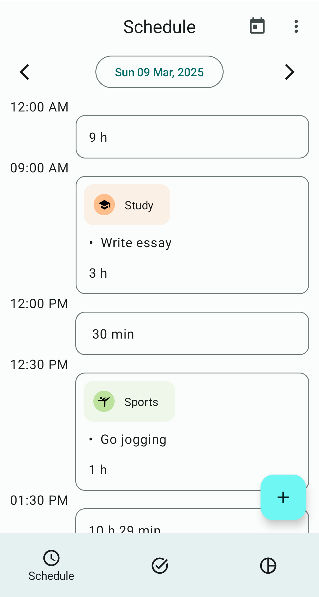
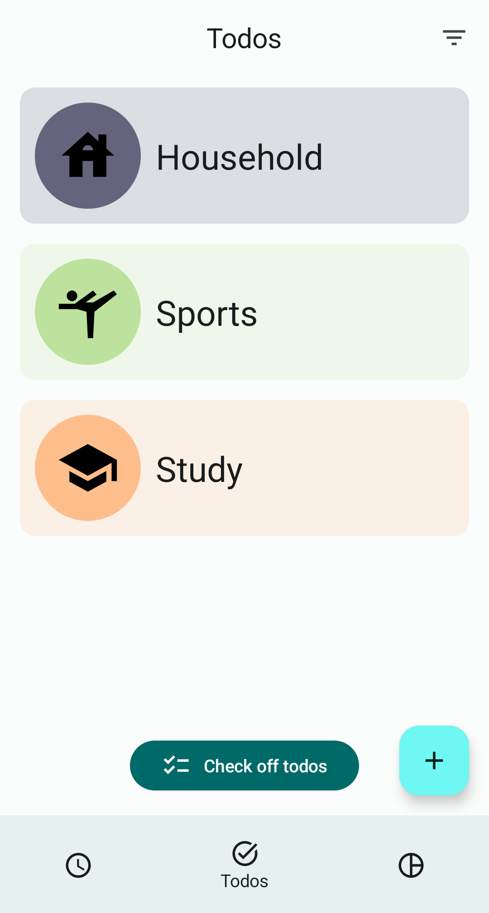
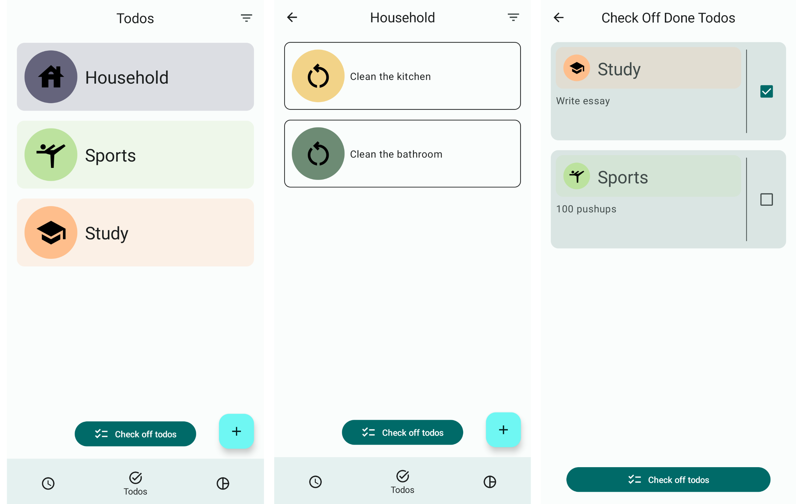
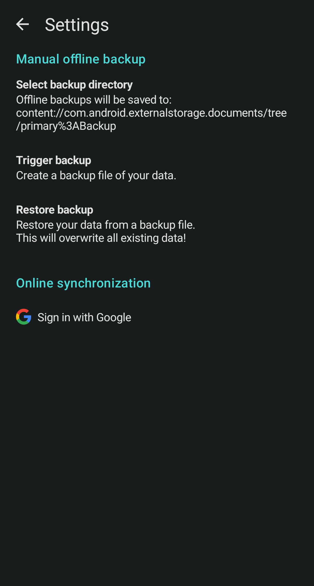
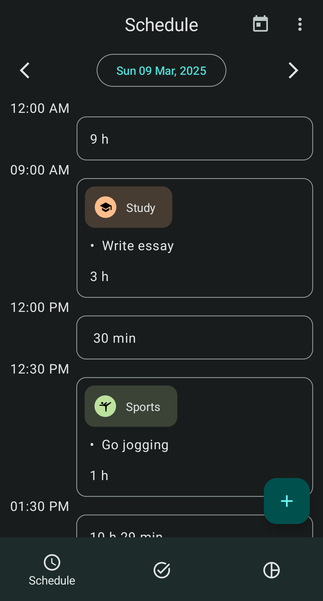
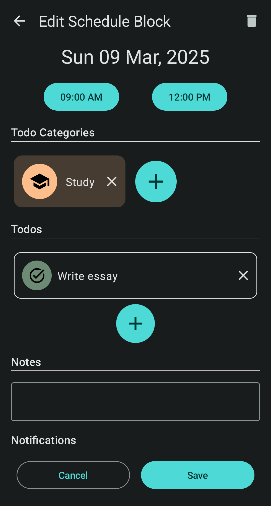
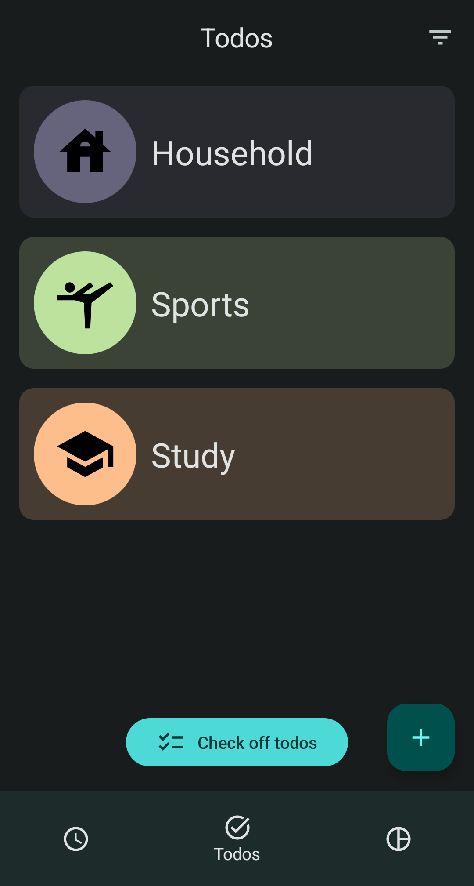

# Schetodo - todo and daily planner app

Schetodo is an android app that allows you to structure your todos and plan your day.

 

# Features

## Daily planner

- Create a schedule for your day. Schedules are made up of "schedule blocks"
- Schedule blocks contain:
    - date
    - start and end time
    - todo categories
    - todos
    - additional notes
    - notifications (at the beginning or end of schedule block)
- You can also create schedule templates to quickly reuse schedules with the same structure.

## Todo and todo categories

- You can easily create and edit todos and structure them in todo categories
- Todos can be recurring or one-time todos. They consist of:
    - the assigned category
    - description
    - priority
    - status for one-time todos (undone, in progress, done)
- Todo categories contain todos and subcategories, creating a folder structure. They consist of:
    - name
    - icon
    - color
- Check off todos
    - Scheduled one-time todos can be checked off in a separate screen (which sets the status of the
      todo to "done")
- Filter your todos
    - Only show undone, in progress, done or recurring todos

## Backups

- You can create offline backups of your data and store them on your device
- Comming soon: you can login with your google account and synchronize your data between different
  devices

## Statistics (coming soon)

- Lets you see how much you've done

## Dark mode

Schetodo of course has a dark mode:

  

# Technologies

This Android app uses the following technologies/libraries:

- Jetpack Compose for the UI
- SQLite with Room for the database
- Hilt for dependency injection
- DataStore for storing settings and preferences
- Truth for writing more readable assertions in tests

# Local Execution

To use the sign in with google functionality locally you need to create a web application client
in google cloud console and add the client id to the local.properties file with the name
OAUTH_WEB_CLIENT_ID.
See https://developer.android.com/identity/sign-in/credential-manager-siwg#set-google for more
details.
