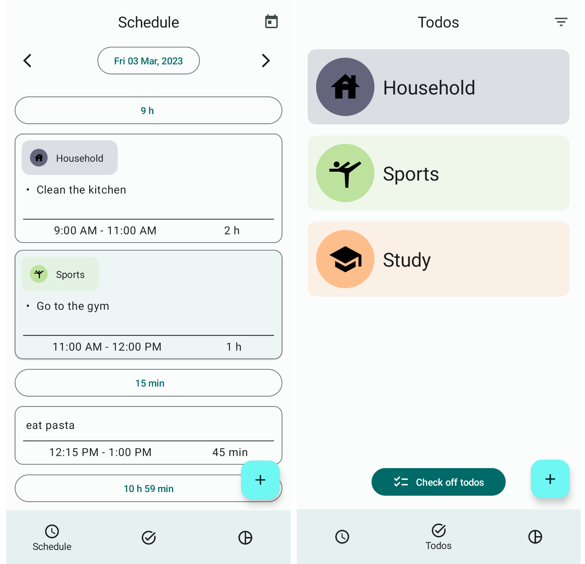
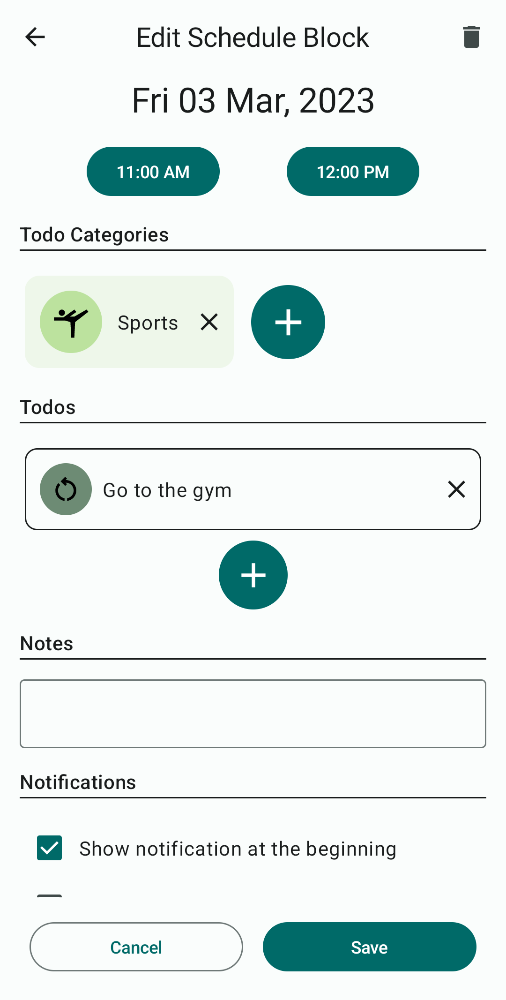
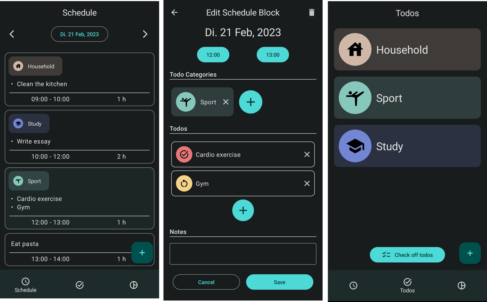

# Schetodo - todo and daily planner app

Schetodo is an android app that allows you to structure your todos and plan your day.

# Screenshots

# Features

## Daily planner

- create a schedule for your day. Schedules are made up of "schedule blocks"
- schedule blocks contain:
  - date
  - start and end time
  - todo categories
  - todos
  - additional notes
  - notifications (at the beginning or end of schedule block)

## Todo and todo categories

- you can easily create and edit todos and structure them in todo categories
- Todos can be recurring or one-time todos. They consist of:
  - the assigned category
  - description
  - priority
  - status for one-time todos (undone, in progress, done)
- Todo categories contain todos and subcategories, creating a folder structure. They consist of:
  - name
  - icon
  - color
- Check off todos
  - scheduled one-time todos can be checked off in a separate screen (which sets the status of the todo to "done")
- filter your todos
  - only show undone, in progress, done or recurring todos

## Statistics (coming soon)

- lets you see how much you've done

## Dark mode

Schetodo also has a dark mode:

# Technologies

This is an Android Studio Project. The code is written in Kotlin and the UI is implemented with Jetpack Compose. The following Libraries are used among others:

- Room for the database
- Hilt for dependency injection
- Truth for writing more readable assertions in tests

# Local Execution
- To use the sign in with google functionality locally you need to create a web application client in google cloud console and add the client id to the local.properties file with the name OAUTH_WEB_CLIENT_ID. See https://developer.android.com/identity/sign-in/credential-manager-siwg#set-google for more details.
